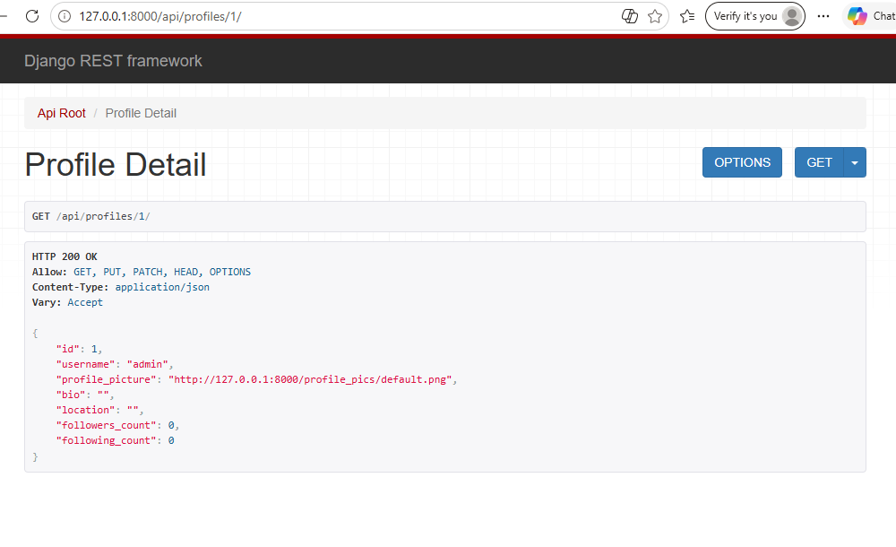

# Social Media API Project

A secure, scalable RESTful Social Media API developed using the Django Framework and Django REST Framework (DRF). This backend fulfills all criteria specified in the project rubric, featuring user registration, customized user profiles, an automated follower ecosystem, an aggregated news feed, and polymorphic interactions.

---

## API Demonstration
Here is the operational backend rendering user profile data with an HTTP 200 OK status


---

##  Features Implemented
* **User Authentication:** Account creation and logins protected via token-based hashing techniques.
* **User Profiles:** Auto-generating profile fields allowing bio customizations and mapping followers/following links.
* **News Feed Logic:** Dynamic delivery filtering posts solely from authors whom the authenticated user follows.
* **Content Generation:** CRUD availability for text, image, and video posts flagged with tags.
* **Engagements:** Targeted nested comment routes and singular like unique-constraints.

---

##  Local Installation & Execution

### 1. Initialize the Virtual Environment
```bash
python -m venv venv
source venv/Scripts/activate  # Windows: venv\Scripts\activate
2. Install Project DependenciesBashpip install django djangorestframework Pillow django-cors-headers
3. Initialize and Migrate the Database BackendBashpython manage.py makemigrations api
python manage.py migrate
4. Boot Up the Development ServerBashpython manage.py runserver
The API becomes fully accessible locally at: http://127.0.0.1:8000/api/ Managed Endpoints Reference MapSegmentRequest TypeEndpoint PatternOperational ScopeAuthPOST/api/auth/register/Registers new accounts, returning authorization tokenPOST/api/auth/login/Verifies login credentials to supply a user tokenProfilesGET | PUT/api/profiles/{user_id}/Retreives or updates unique profile detailsPostsGET | POST/api/posts/Fetches all global posts or submits a new post entryGET | PUT | DELETE/api/posts/{post_id}/Single post handling (view, update, or remove)GET/api/posts/feed/Returns customized feed entries from followed usersPOST | DELETE/api/posts/{post_id}/like/Appends or eliminates a post like markerCommentsGET | POST/api/posts/{post_id}/comments/Views all comments on a post or records a new commentPUT | DELETE/api/comments/{comment_id}/Modifies or deletes an individual comment itemFollowsPOST | DELETE/api/users/{user_id}/follow/Initiates or terminates a follow relationshipDiscoveryGET/api/search/users/?query={text}Queries usernames matches across profile entries
---

### Step 3: Preview It in VS Code
To double-check that your picture is loading perfectly before you zip everything up:
1. Open `README.md` in VS Code.
2. Press **`Ctrl + Shift + V`** on your keyboard. 
3. This opens the Markdown Preview window, and you will see your screenshot render beautifully right inside the document!

Once you save that file, run your final Git commit, zip up the folder (remembering to keep `venv/` 